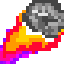

# Project-Astro

Project Astro is a game that is made in <b>JavaScript/HTML5/CSS</b>. The game is drawn on an <b>HTML5</b> Canvas element.

This project was intended to strengthen my understanding of HTML5 game animations. The `main.js` file contains roughly 1000 lines, powering _everything_ in the game, from visual animations to physics.

Currently the game features no sound, although sound is expected to be added eventually.

-----
## Preview

**Play the game now through GitHub Pages:**
**https://ffffff-base16.github.io/Project-Astro/**

-----
## How To Play
### **Movement**
Use standard keyboard controls to move your player:

<kbd>W</kbd> + <kbd>A</kbd> + <kbd>S</kbd> + <kbd>D</kbd>

### **Abilities**
** Asteroid:** 
A high damage skill shot on a 2 second cooldown.

** Laser:** 
A tracking-based laser powered by energy that drains upon use, and rebuilds over time.

### **Levels**
There are 7 levels, with overall speed of both players increasing per level.

### **Goal**
The goal of Project Astro is to beat all 7 levels as fast as possible. Levels rapidly become more difficult, as overall speed intensifies. Timing and precision of ability usage becomes increasingly more important as levels progress.

-----
## Browser Compatibility

As of **September 2021**, Project Astro has only been tested in _**Google Chrome,  Version 92.0.4515.159**_. 

Multi-browser compatibility is not a priority at the moment, as the library is still under initial development.

The game is expected to work in most modern browsers that support _HTML5 Canvas elements_.

-----
## Credits
All images and code in the game were created by me, although I referenced <b>MDN Web Docs</b> occasionally to learn about different built-in functions of JavaScript/CSS/HTML5. 